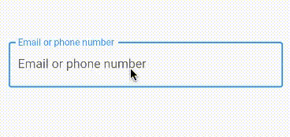
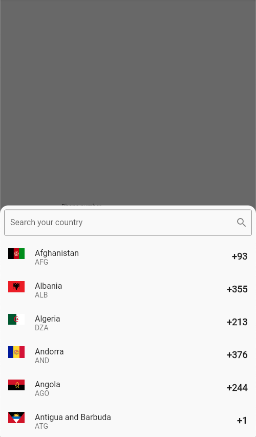
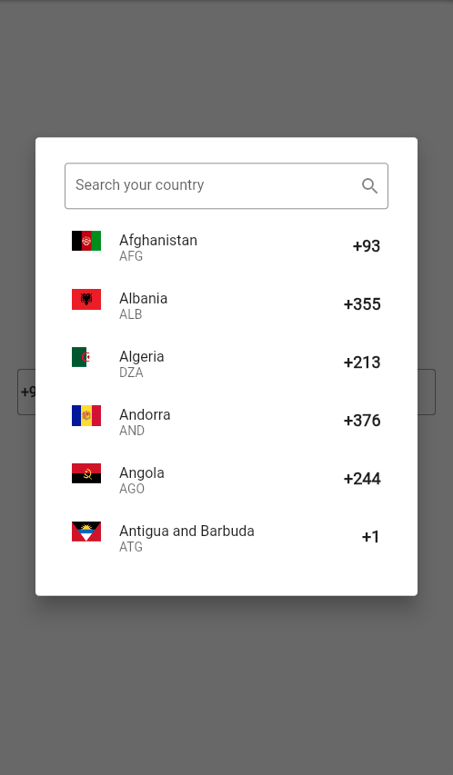

# EphoneField
  
  [](https://github.com/desxz/ephone_field)
  [](https://pub.dartlang.org/packages/ephone_field)
  [](https://github.com/desxz/ephone_field/actions/workflows/main.yaml)
  [](https://codecov.io/gh/desxz/ephone_field)
  [](https://opensource.org/licenses/MIT)

A versatile Flutter TextFormField widget for handling email and phone number input with ease.

This custom TextField package simplifies the process of capturing email and phone number input
in your Flutter applications. It offers real-time validation and user-friendly error handling (in dev),
making it a valuable addition to any form or input-focused application. Whether you're building
a sign-up form, a contact input screen, or anything in between, this package can save you time
and effort by handling the intricacies of email and phone number input for you.

## Features

- Versatile: Handles email and phone number input
- Masking: Automatically formats phone numbers as they are entered
- Customizable: Customize the appearance of the widget to fit your application
- Easy to use: Simply add the widget to your UI and let it handle the rest
- Error handling: Provides real-time validation and user-friendly error handling (in dev)
- Tested: Unit tests ensure that the widget works as expected

## Getting started

In the `pubspec.yaml` of your flutter project, add the following dependency:

```yaml
dependencies:
  ...
  ephone_field: ^0.0.1
```

Import it:

```dart
import 'package:ephone_field/ephone_field.dart';
```
## Usage

Implement the `EmailPhoneField` widget in your UI:

```dart
EPhoneField()
```

### EphoneField



### EphineField Country Picker Widgets




## Additional information

| Property                 | Description                                  | Type                       | Default                                 |
| ------------------------ | -------------------------------------------- | -------------------------- | --------------------------------------- |
| key                      | The key for the input field.                 | `Key`                      | `null`                                  |
| initialType              | The initial type of the input field.         | `EphoneFieldType`          | `EphoneFieldType.initial`               |
| countries                | The list of countries to display.            | `List<Country>`            | `Country.all`                           |
| controller               | The controller for the input field.          | `TextEditingController`    | `TextEditingController()`               |
| focusNode                | The focus node for the input field.          | `FocusNode`                | `FocusNode()`                           |
| decoration               | The decoration for the input field.          | `InputDecoration`          | `InputDecoration()`                     |
| keyboardType             | The keyboard type for the input field.       | `TextInputType`            | `EphoneFieldType.keyboardType`          |
| searchInputDecoration    | The decoration for the search input field.   | `InputDecoration`          | `InputDecoration()`                     |
| isSearchable             | Whether the search input is enabled.         | `bool`                     | `true`                                  |
| title                    | The title for the country picker.            | `String`                   | `null`                                  |
| titlePadding             | The padding for the title of country picker. | `EdgeInsetsGeometry`       | `EdgeInsets.all(8.0)`                   |
| pickerHeight             | The height of the country picker.            | `CountryPickerHeigth`      | `CountryPickerHeigth.h50`               |
| menuType                 | The type of the picker menu.                 | `PickerMenuType`           | `PickerMenuType.bottomSheet`            |
| initialCountry           | The initial country of country picker.       | `Country`                  | `Country.unitedStates`                  |
| initialValue             | The initial value of the input field.        | `String`                   | `null`                                  |
| emptyLabelText           | The label text when the input is empty.      | `String`                   | `Email or phone number`                 |
| emailLabelText           | The label text when the field type is email. | `String`                   | `Email`                                 |
| phoneLabelText           | The label text when the field type is phone. | `String`                   | `Phone`                                 |
| countryPickerButtonIcon  | The icon for the country picker button.      | `Icon`                     | `Icon(Icons.arrow_drop_down)`           |
| phoneNumberMaskSplitter  | The splitter for the phone number mask.      | `MaskSplitCharacter`       | `MaskSplitCharacter.space`              |
| countryPickerButtonWidth | The width of the country picker button.      | `double`                   | `100.0`                                 |
| autovalidateMode         | The autovalidate mode of the input field.    | `AutovalidateMode`         | `AutovalidateMode.onUserInteraction`    |
| onChanged                | The callback when the input value changes.   | `ValueChanged<String>`     | `null`                                  |
| onSaved                  | The callback when the input is saved.        | `ValueChanged<String>`     | `null`                                  |
| validator                | The validator for the input field.           | `FormValidator`            | `null`                                  |
| onFieldSubmitted         | The callback when the input is submitted.    | `ValueChanged<String>`     | `null`                                  |
| onCountryChanged         | The callback when the country is changed.    | `ValueChanged<Country>`    | `null`                                  |
| inputFormatters          | The input formatters for the input field.    | `List<TextInputFormatter>` | `EphoneFieldType.inputFormatters()` |