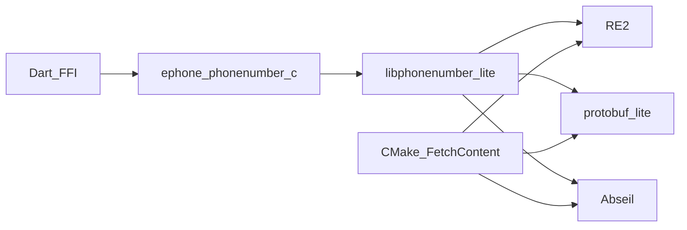

# Native architecture

Maintainer notes for the Android/iOS FFI stack around Google libphonenumber.

## Goals

- Honest platform support (Android/iOS only)
- Consumer installs that can skip fragile CMake when prebuilts exist
- Small collision surface with other plugins’ Abseil/protobuf/RE2
- Slim public Dart API (`EPhoneField` + config/validators)

## Build graph



- Sources: [`src/`](../src/), vendored slim tree in [`third_party/libphonenumber`](../third_party/libphonenumber)
- Mobile deps: [`src/cmake/EphoneMobileDeps.cmake`](../src/cmake/EphoneMobileDeps.cmake) (Abseil, protobuf-lite, RE2 — **no ICU**)
- Digit normalize uses a local Nd→ASCII shim (`tool/patches/libphonenumber-no-icu.patch`)
- iOS CocoaPods runs [`ios/cmake_build.sh`](../ios/cmake_build.sh), which:
  1. Prefers `ios/prebuilt/libephone_phonenumber_stack-${PLATFORM_NAME}.a` if present
  2. Otherwise builds + merges deps, then `ld -r -exported_symbols_list` so only
     [`ios/ephone_exports.txt`](../ios/ephone_exports.txt) (`ephone_*`) stay global

## Prebuild

```bash
./tool/prebuild_ios.sh
PLATFORM_NAME=iphoneos ARCHS=arm64 ./tool/prebuild_ios.sh
```

Archives under `ios/prebuilt/` are gitignored. CI caches FetchContent `_deps` and
uploads the simulator prebuilt on `main` pushes.

## Deferred

- Vendoring Abseil/protobuf/RE2 into git (FetchContent + CI cache is enough)
- Publishing prebuilts to GitHub Releases for tagged versions
