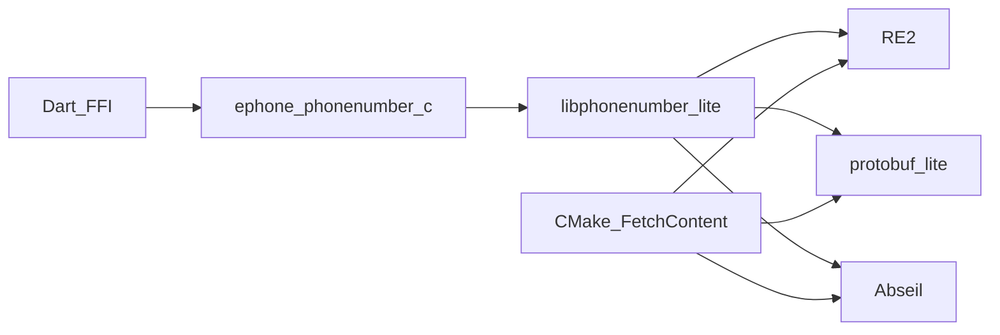

# Native architecture

Maintainer notes for the Android/iOS FFI stack around Google libphonenumber.

## Goals

- Honest platform support (Android/iOS only)
- **Zero-friction consumer installs** — prebuilt natives ship in the pub package
- Small collision surface with other plugins’ Abseil/protobuf/RE2
- Slim public Dart API (`EPhoneField` + config/validators)

## Consumer vs maintainer

| Audience | What they get |
| --- | --- |
| `flutter pub add ephone_field` | `ios/prebuilt/*.a` + `android/src/main/jniLibs/**/libephone_field.so` — no CMake, no FetchContent |
| Path / git checkout without prebuilts | CMake fallback (needs CMake + network once) |

Publish / CI must pass `./tool/assert_prebuilts.sh`. Rebuild after LPN upgrades with
`./tool/prebuild_all.sh`.

## Build graph (maintainer rebuild)



- Sources: [`src/`](../src/), vendored slim tree in [`third_party/libphonenumber`](../third_party/libphonenumber) (git only; excluded from pub)
- Mobile deps: [`src/cmake/EphoneMobileDeps.cmake`](../src/cmake/EphoneMobileDeps.cmake) (Abseil, protobuf-lite, RE2 — **no ICU**)
- Digit normalize uses a local Nd→ASCII shim (`tool/patches/libphonenumber-no-icu.patch`)
- iOS CocoaPods runs [`ios/cmake_build.sh`](../ios/cmake_build.sh), which:
  1. Prefers `ios/prebuilt/libephone_phonenumber_stack-${PLATFORM_NAME}.a` if present
  2. Otherwise builds + merges deps, then `ld -r -exported_symbols_list` so only
     [`ios/ephone_exports.txt`](../ios/ephone_exports.txt) (`ephone_*`) stay global
- Android [`android/build.gradle`](../android/build.gradle) prefers `jniLibs` when
  `arm64-v8a/libephone_field.so` exists; otherwise `externalNativeBuild` CMake

## Prebuild

```bash
./tool/prebuild_all.sh
# or separately:
./tool/prebuild_ios.sh --all
./tool/prebuild_android.sh
./tool/assert_prebuilts.sh
```

Shipped ABIs:

- iOS: `iphoneos` + `iphonesimulator` arm64 (~2.6 MB each)
- Android: `arm64-v8a`, `armeabi-v7a`, `x86_64` (stripped ~2 MB each)

## Deferred

- Vendoring Abseil/protobuf/RE2 into git (FetchContent is maintainer-only now)
